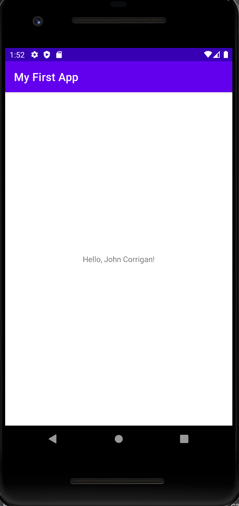

# LIS 4381

## John Corrigan

### Assignment #1 Requirements:

*Sub-Heading:*

1. Initialize class repo
2. Install AMPPS
3. Install Android Studio

#### README.md file should include the following items:

* Install ampps
* Install JDK
* Install Android Studio
* Create my first app

> #### Git commands w/short descriptions:

1. git init -
2. git status - 
3. git commit - 
4. git push - 
5. git pull - 
6. git add - 
7. git 

#### Assignment Screenshots:

*Screenshot of AMPPS running http://localhost*:

*Screenshot of running java Hello*:

*Screenshot of Android Studio - My First App*:

#### Tutorial Links:

*Bitbucket Tutorial - Station Locations:*
[A1 Bitbucket Station Locations Tutorial Link](https://bitbucket.org/username/bitbucketstationlocations/ "Bitbucket Station Locations")

*Tutorial: Request to update a teammate's repository:*
[A1 My Team Quotes Tutorial Link](https://bitbucket.org/username/myteamquotes/ "My Team Quotes Tutorial")