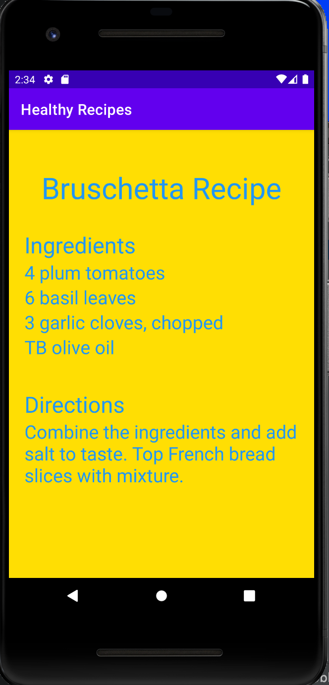
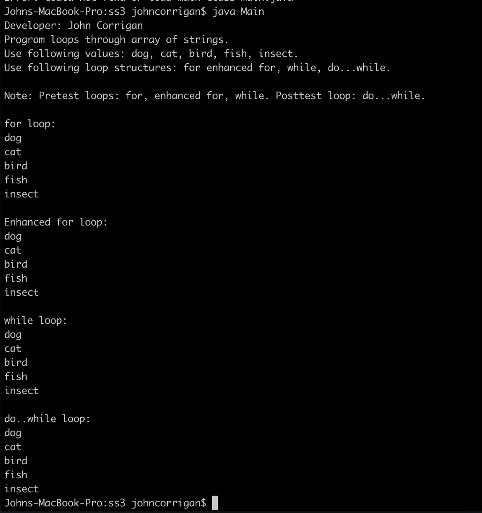

# LIS 4381

## John Corrigan

### Assignment #1 Requirements:

*Sub-Heading:*

1. Create Bruschetta Recipe app
2. Must have working button to another page
3. Complete skillsets 1-3

#### README.md file should include the following items:

* Screenshot of running app
* Screenshots of skillsets 1-3 runningin terminal

#### Assignment Screenshots:

*Screenshot of App homepage running http://localhost*:

*Screenshot of recipe list page:

*Screenshot of Skillset 1 Even or odd*:

*Screenshot of Skillset 2 Largest number*:

*Screenshot of Skillset 3 arrays*:

