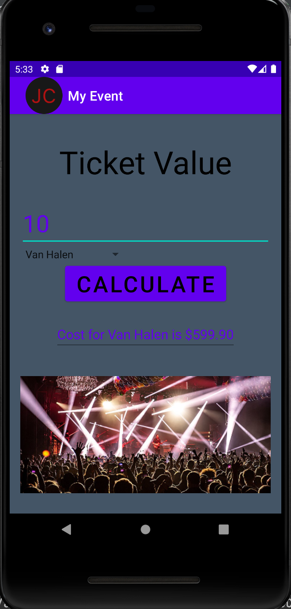
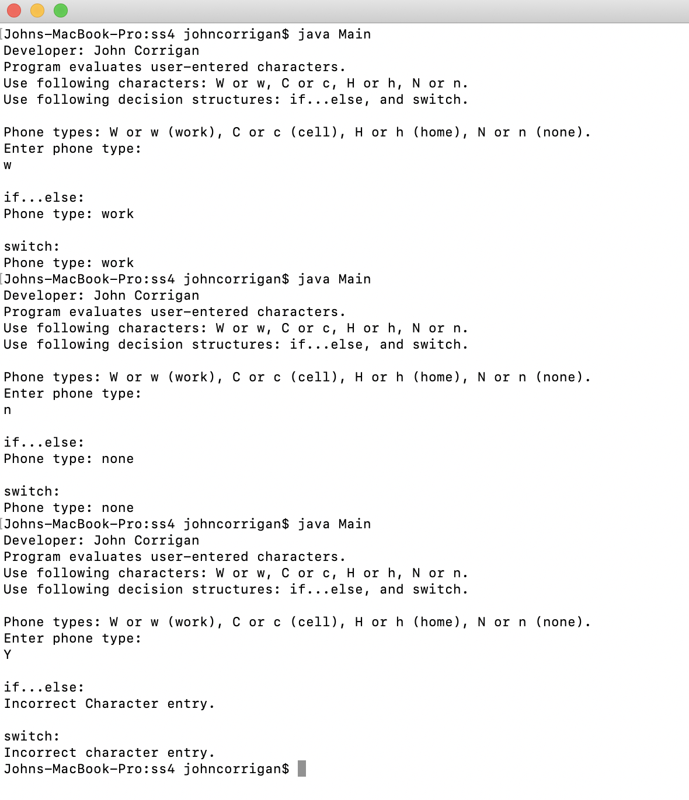
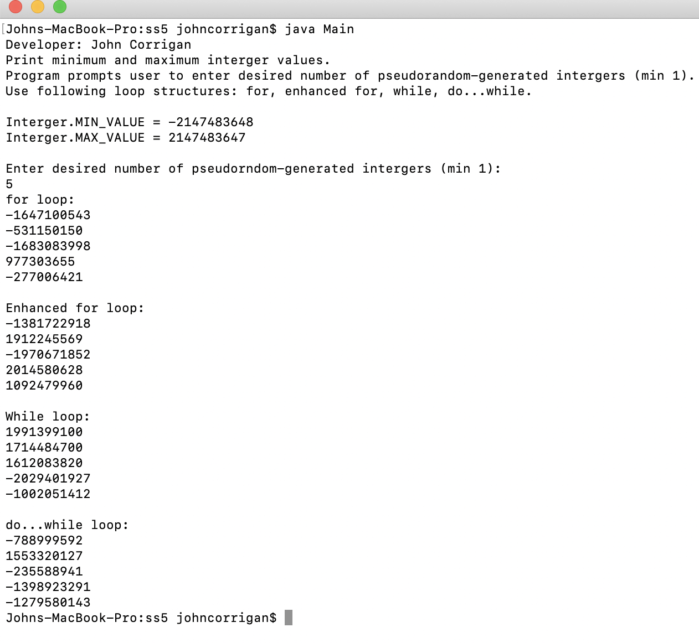
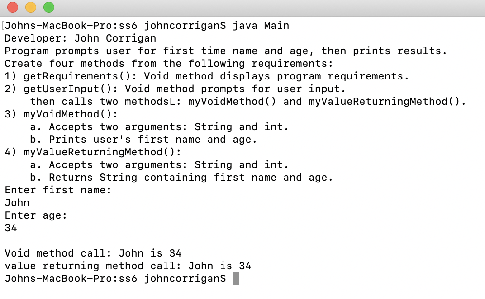
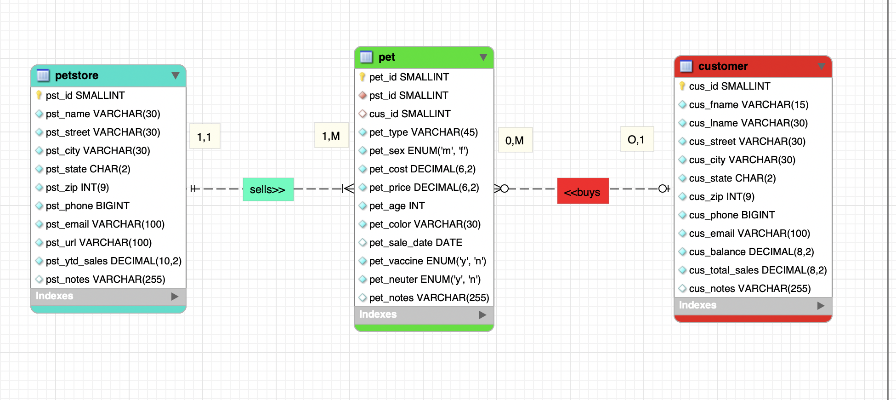
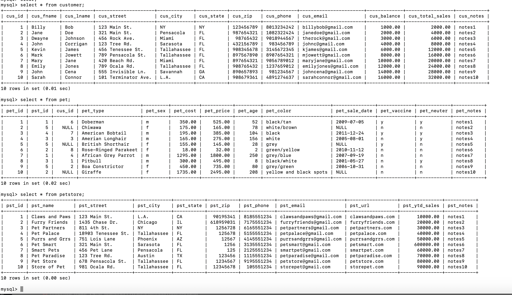

# LIS 4381

## John Corrigan

### Assignment #3 Requirements:

*Sub-Heading:*

1. Create ERD based on business rules
2. Create My Event Ticket Value Andorid app
3. Complete skillsets 4-6

#### README.md file should include the following items:

* Screenshot of ERD
* Screenshots of app before and after user input
* Screenshots of skillsets 4-6 running in terminal

#### Assignment Screenshots:

*Screenshot of App homepage running http://localhost*:

<table><tr>
<td>  </td>
<td>  </td>
</tr></table>

*Screenshot of Skillset 4 Decision Structures*:

*Screenshot of Skillset 5 random number generator*:

*Screenshot of Skillset 6 methods*:

*Screenshot of ERD*:

*Screenshot of Populated tables*:

