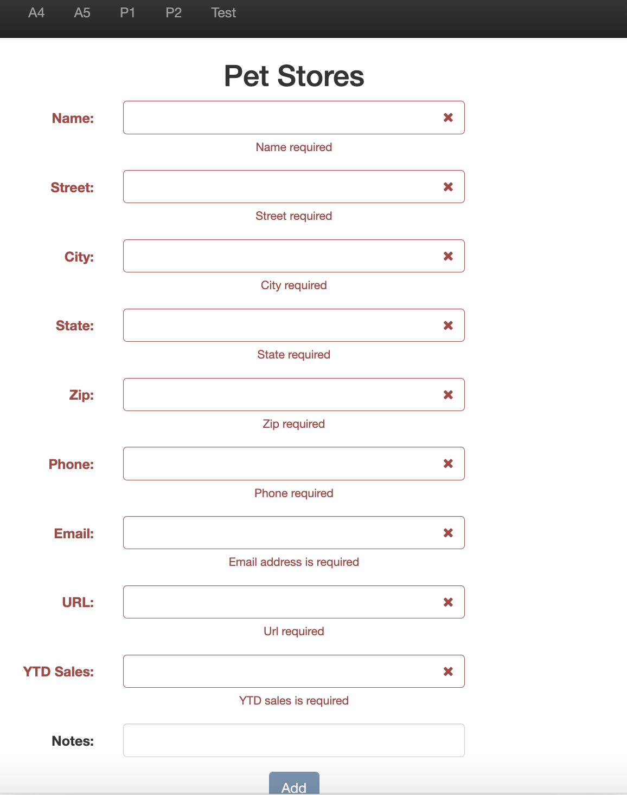
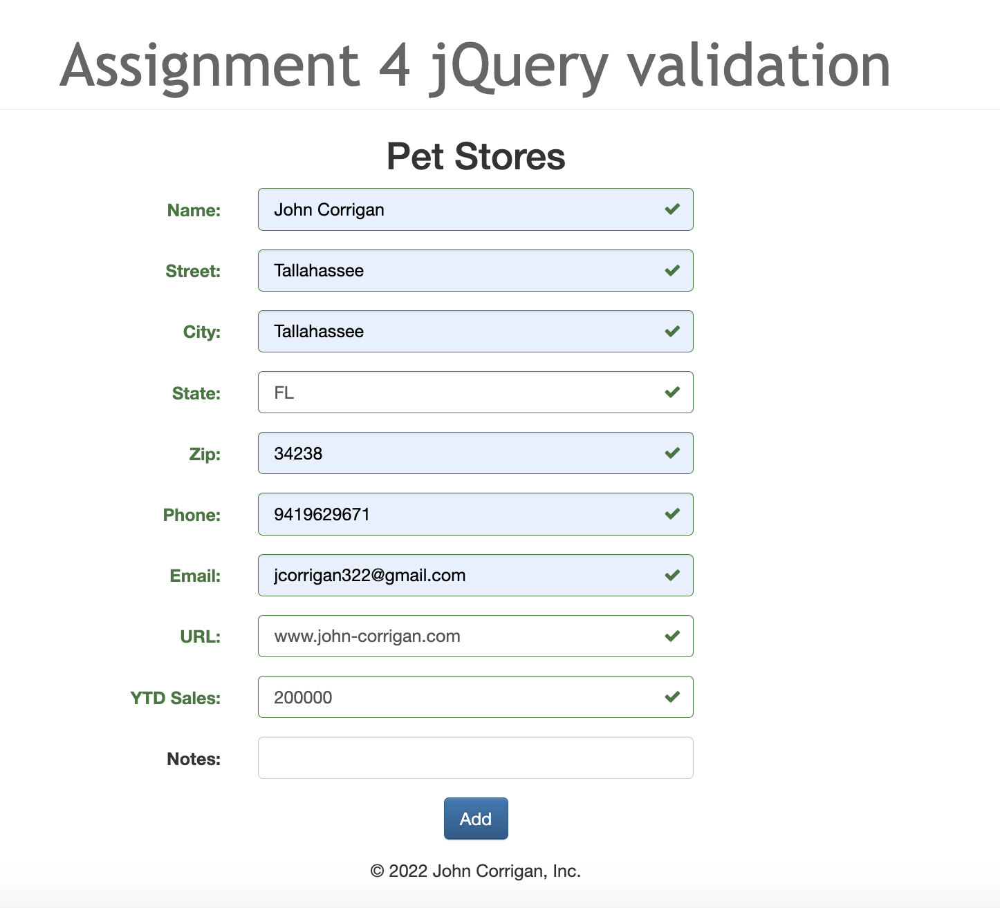
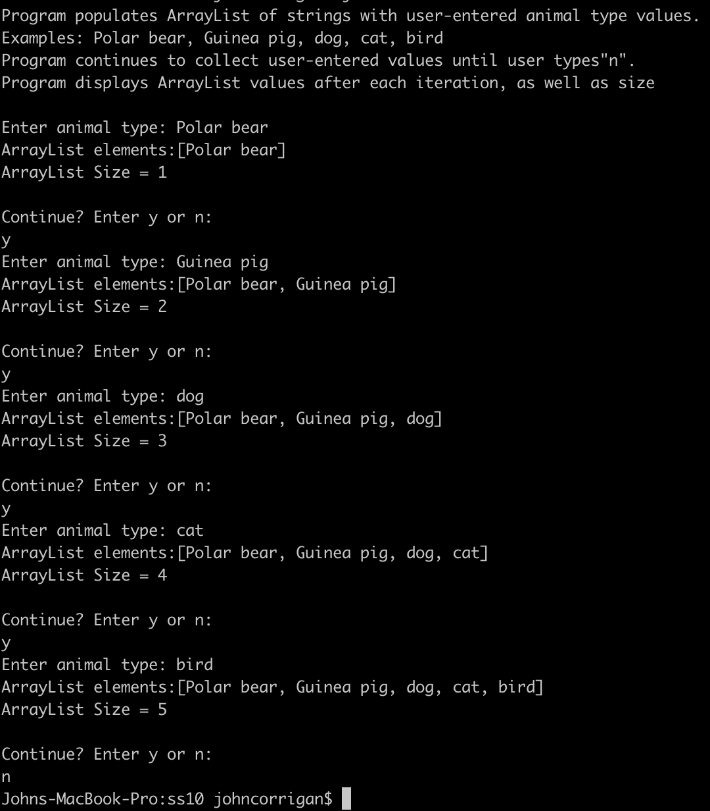
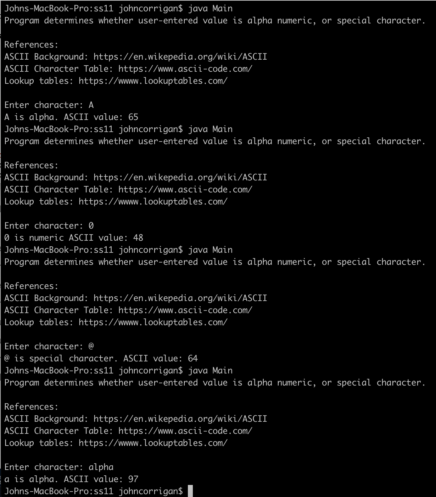
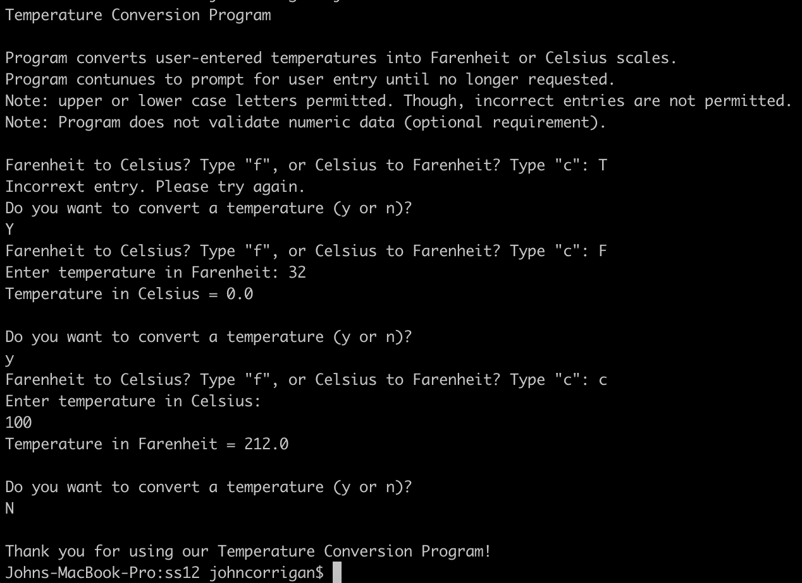

# LIS 4381

## John Corrigan

### Assignment #4 Requirements:

1. jQuery validation client side
2. Complete skillsets 10-12
3. Add images and links to carousel 

#### README.md file should include the following items:

* Course title, name, and requirements
* Screenshots of applications first interface
* Screenshots of applications second interface

#### Assignment Screenshots:

*Screenshot of jQuery validation client side*:

<table><tr>
<td>  </td>
<td>  </td>
</tr></table>

*Screenshot of Skillsets*:

<table><tr>
<td>  </td>
<td>  </td>
</tr></table>

