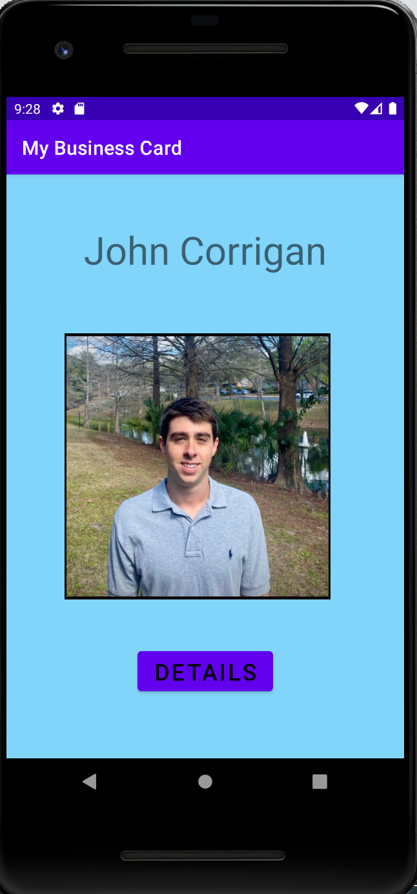
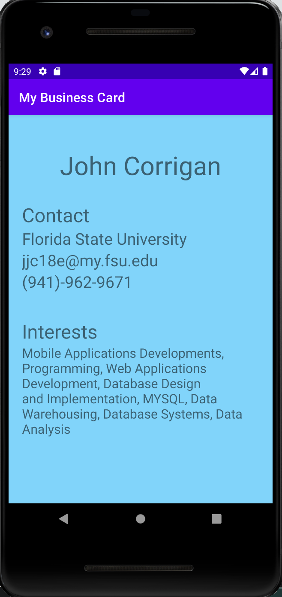
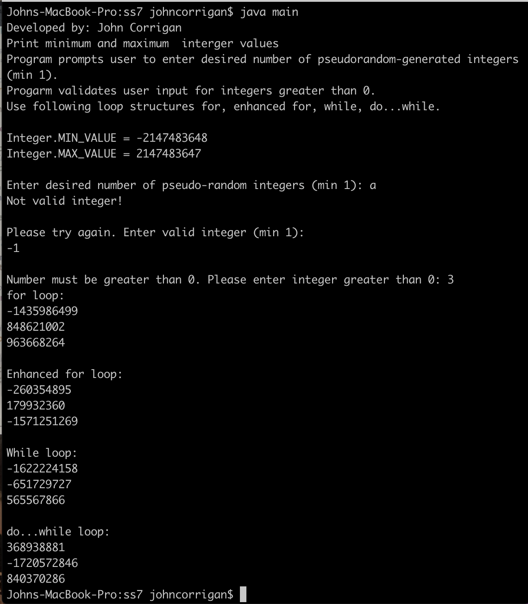
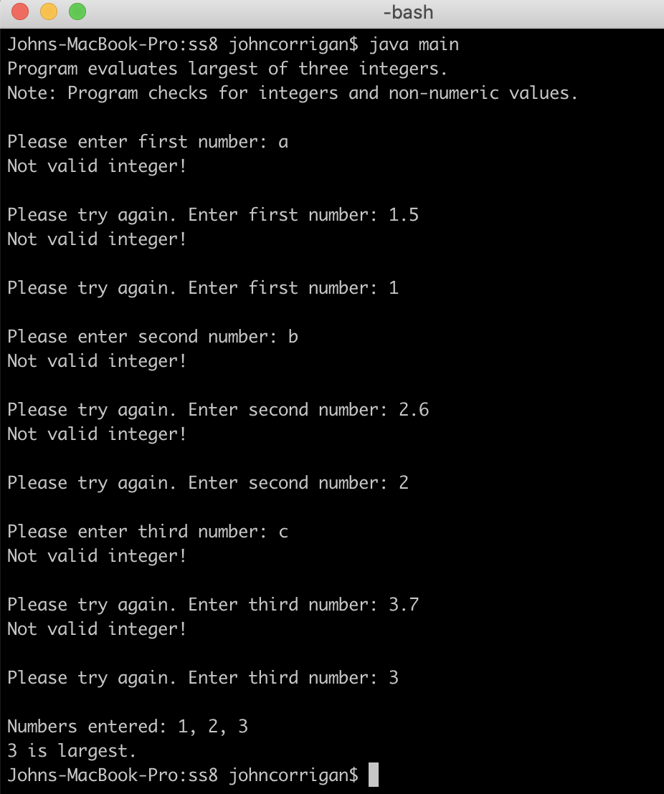
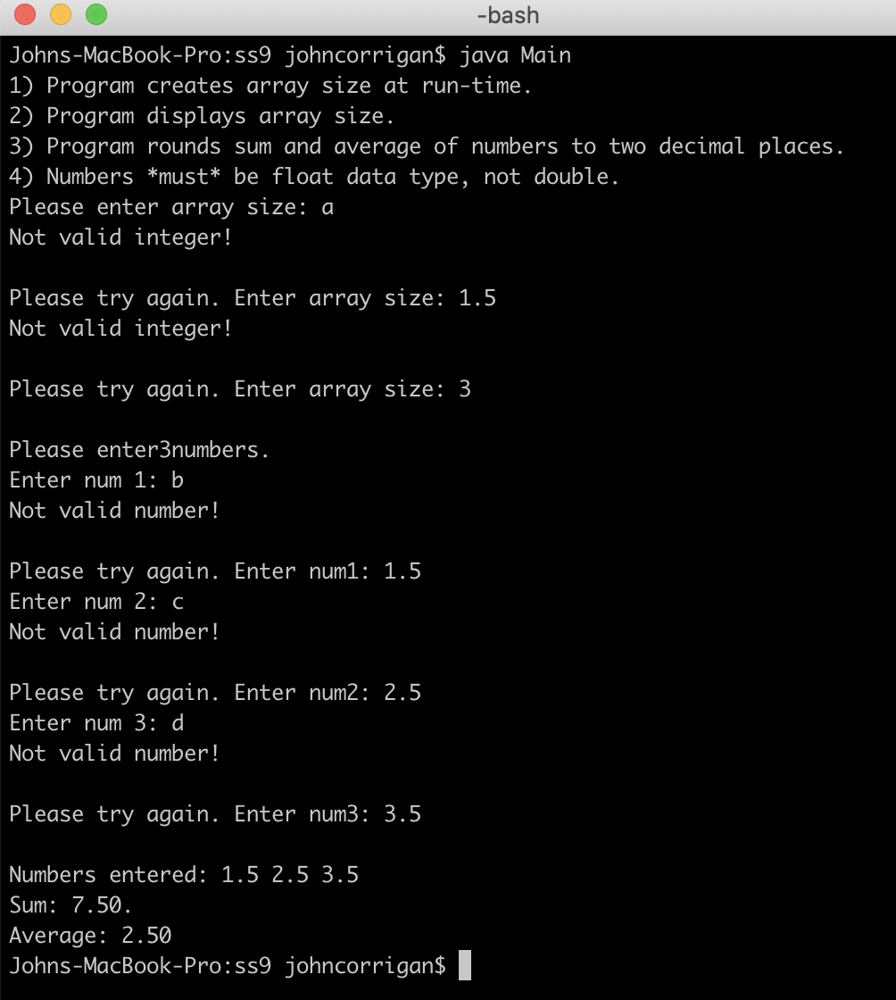

# LIS 4381

## John Corrigan

### Project #1 Requirements:

*Sub-Heading:*

1. Create Business card front page
2. Create Business card details page
3. Complete skillsets 7-9

#### README.md file should include the following items:

* Course title, name, and requirements
* Screenshots of applications first interface
* Screenshots of applications second interface

#### Assignment Screenshots:

*Screenshot of App homepage running http://localhost*:

<table><tr>
<td>  </td>
<td>  </td>
</tr></table>

*Screenshot of Skillset 7 Random number generator*:

*Screenshot of Skillset 8 Largest of three numbers*:

*Screenshot of Skillset 9 Array runtime*:

